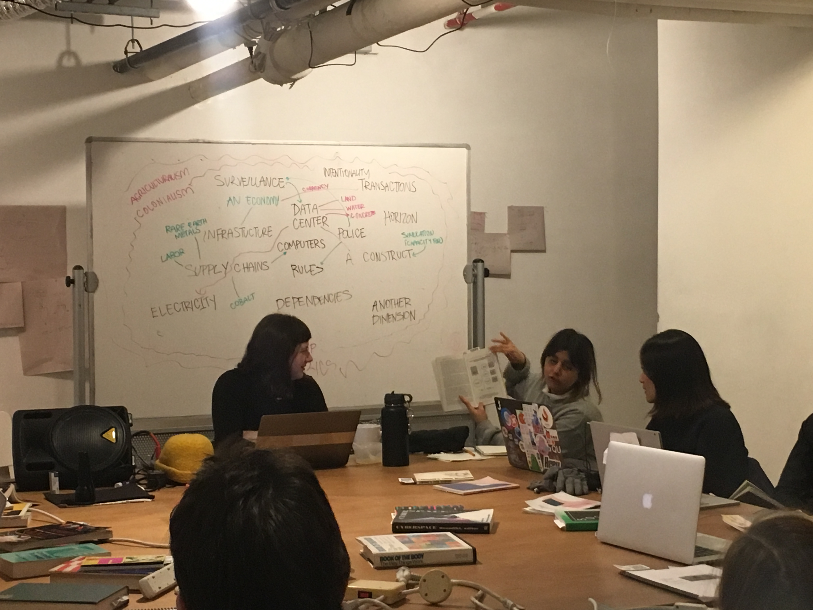
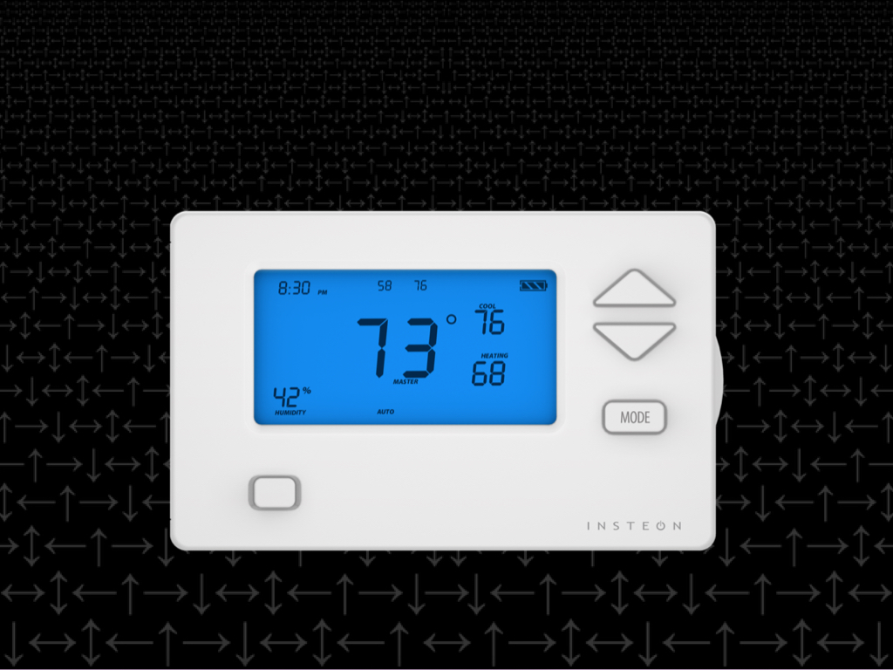
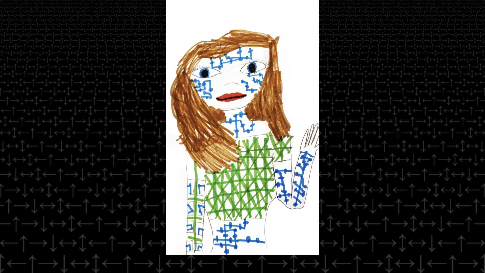
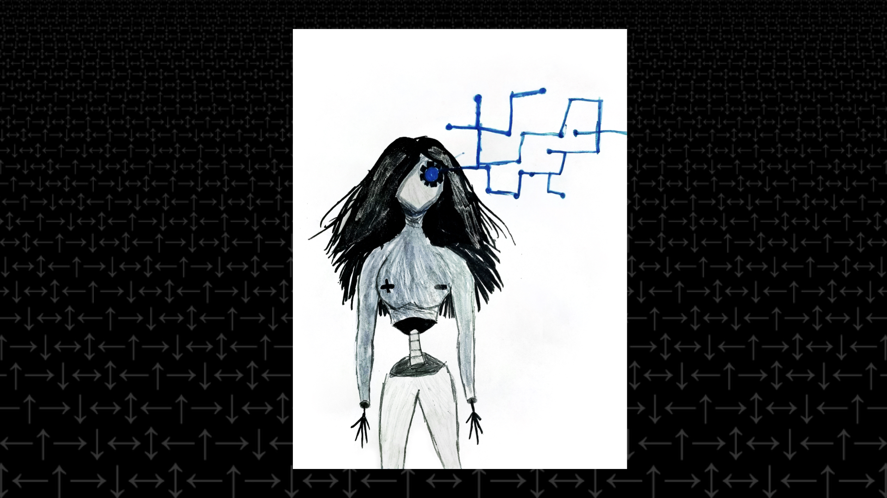

## Cybernetics of Sex: Technology, Feminisms, & the Choreography of Culture
Day 10: Code Societies with Melanie Hoff

Knowing Melanie in her capacity as an organizer for Code Societies thus far, it was exciting to see her put on her teacher hat and have us consider sex and gender as a case study for learning about systemic problems and feedback loops in cybernetics.

To begin the class, we were tasked with browsing the Cybernetics of Sex collection to find a diagram, image, or sentence connected to something we had been thinking about recently. Like Yasmeen pictured above, we then shared our thoughts with each other to open up discussion about Melanie's focus for the class: Cybernetics of Sex. This browsing library had been introduced to us by Sarah Hamerman last Saturday as a curated collection from the larger [Cybernetics Library](cybernetics.social) at [Prime Produce](https://www.primeproduce.coop/) in Hell's Kitchen.

Melanie then opened up more about her artistic practice that had been largely opaque to us until this point. Starting with an interest in sculpture and metalworking, she created work that experimented with running electricity through wood and isolating bismuth from pepto-bismol from using chemicals from Home Depot. However she found that her work lent to conversations about the wonder of nature and spectacle of beauty rather than dialogue around societal formations and organization she was interested in. This led to Melanie adapting her art practice to focus more on technology and being involved in a variety of collectives and projects in addition to SFPC: [Soft Surplus](https://www.instagram.com/softsurplus/), [Cybernetics Conference](https://cybernetics.social/schedule/) and [Small Data Squad](https://melanie-hoff.com/sds/) amongst others.

The rest of the class was focused on deconstructing the title of her talk _Cybernetics of Sex: Technology, Feminisms, & the Choreography of Culture_ word by word.

###### Cybernetics
Through a scatter of definitions and examples, we explored the meaning of 'cybernetics'. First, Melanie introduced the greek root 'kubernetes' of the English word 'cybernetics', meaning 'to steer'. Some other definitions from members of the Cybernetics of Sex library included:
- The distribution of self across intersecting systems of power
- Transdisciplinary study of feedback and control across technological, social, and cultural systems
- The study of regulatory systems and feedback loops; a holistic approach to governing phenomena

A canonical example of cybernetics can be seen in a thermostat. Here the goal of the system is to regulate temperature within a set range and the feedback loop operating as such:

action -> reaction -> observation -> internal change -> action ->

This example also served to illustrate how cybernetics looks at how to design dynamic self-correcting systems. Melanie went on to introduce an iceberg model that pointed to the need for systems thinking as opposed to event-oriented thinking with "Events" as the visible portion of the iceberg above water, and the following sections of the iceberg as we delve deeper below the surface: Patterns of behavior, systems structure and mental models. Akin to Taeyoon's warning of the dangers of centralized networks in his class, Melanie put forward these various examples as an entry point to understanding cybernetics and therefore ways of being in the world with each other -- with all our bodies, as well as computers and computing systems.

###### Sex & Technology
Next we looked at 'sex' and 'technology' which often intersected in the consideration of gender as a social technology of control of non cis-het male bodies. Through sharing experiences of when we first became cognizant of our gender presentation, we began to posit our relationships to gender and sex. Some expressed a lack of specific memory that created self-awareness of gender while others pointed to heightened gender presentations in the US in comparison to countries like Sweden that have flattened the gender binary.

The story of “The Egg and the Sperm” as pictured in the slide above is an example of how gender stereotypes are framing a supposedly objective scientific depiction of reproduction. In this fictional romance starring patriarchy, the egg is depicted as an object with no agency while the sperm aggressively hunt for the egg in a seemingly easy process, wherein reality both are equally involved in this dance and it is not as straightforward as commonly depicted.

These gender stereotypes are entangled in how we perform and are controlled in society, with birth control being another example of this. With the consideration of masculinity in computation, Melanie showed us how gender bias is coded into google translate, where Turkish sentences regarding occupations turn from gender neutral to gendered in English, such as "he is a doctor". She also showed us excerpts from her “Draw What Alexa looks like” project where she got young children growing up with Siri and Alexa in their homes to draw what they thought they looked like. Below are examples of drawings by the same child one year apart.

Below are lists of synonyms and antonyms of power that we came up with as a class.

Synonyms: Pants / Control / Force / Yes / Strength / Ability / Movement / Money / Denial / Influence / Violence / Non-responsibility / Ego / Aggression / Sovereignty / Superiority / Singular / Surrender

Antonyms: Femininity / Compassion / Acceptance / Empathy / Beauty /Sexiness / “Because” as externalization

###### Feminisms
Forms of feminism we discussed:
- [Womanism](https://www.google.com/search?q=womanism+alice+walker&oq=womanism+alice+walker&aqs=chrome..69i57.2992j0j4&sourceid=chrome&ie=UTF-8) coined by Alice Walker
- [Misogynoir](https://www.google.com/search?q=misogynoir&oq=misogynoir&aqs=chrome..69i57j0l5.2511j1j4&sourceid=chrome&ie=UTF-8)
- [Xenofeminism](http://www.laboriacuboniks.net/) coined by Laboria Cuboniks
- [The Dialectic of Sex](https://www.versobooks.com/books/1853-the-dialectic-of-sex) by Shulamith Firestone
- [VNS Matrix](https://vnsmatrix.net/about/), a cyberfeminist art collective from Adelaide Australia
- [Common Cyborg](https://granta.com/common-cyborg/) by Jillian Weise that criticizes Donna Haraway's famed _Cyborg Manifesto_ for the erasure of disabled people.

Melanie put forward the example of sex work as a culmination of what we had been discussing in class so far, pointing to the further marginalization of sex workers through the closing of online platforms like Backpages with the passing of SESTA/FOSTA.

###### Choreography of Culture
Looking at the last phrase in Melanie's title for the class, we were shown a myriad of artists and works that she felt illustrated a 'choreography of culture':
- [Tino Seghal](https://www.guggenheim.org/artwork/artist/tino-sehgal)
- [_This is America_](https://www.youtube.com/watch?v=VYOjWnS4cMY) by Childish Gambino
- [FlucT](http://www.sigridlauren.com/fluct/)
- [Disobedient Objects](http://www.disobedientelectronics.com/)
- [_Housewives Making Drugs_](http://maggic.ooo/Housewives-Making-Drugs-2017) starring Jade Phoenix and Jade Renegade, in collaboration with Orgasmic Creative
- [Amalia Ulman](http://www.bbc.com/culture/story/20160307-the-instagram-artist-who-fooled-thousands)
- [_SacredWare_](https://www.rhaberstroh.com/sacredware/) by Beck Haberstroh

In an attempt to tie some of the many threads of conversation we had in class, we looked at quotes from Audre Lorde's texts to consider whether forming a trusting, intimate relationship with computation is possible, or if software is necessarily a context for control.
>“What does it mean when the tools of a racist patriarchy are used to examine the fruits of that same patriarchy? It means that only the most narrow perimeters of change are possible and allowable.” - Audre Lorde

Keeping thoughts of resistance to imperialist computational processes, we closed the class by creating a idstributed speaker system with all out phones at once with images we uploaded from the Cybernetics of Sex library at the beginning of class.

,0 1px 10px 0 rgba(0,0,0,0.15); margin: 1px; max-width:540px; min-width:326px; padding:0; width:99.375%; width:-webkit-calc(100% - 2px); width:calc(100% - 2px);">
 <a href="https://www.instagram.com/p/BsytLKRh3UP/?utm_source=ig_embed&amp;utm_medium=loading" style=" background:#FFFFFF; line-height:0; padding:0 0; text-align:center; text-decoration:none; width:100%;" target="_blank"> 
 

 
 

 

<svg width="50px" height="50px" viewBox="0 0 60 60" version="1.1" xmlns="https://www.w3.org/2000/svg" xmlns:xlink="https://www.w3.org/1999/xlink"><g stroke="none" stroke-width="1" fill="none" fill-rule="evenodd"><g transform="translate(-511.000000, -20.000000)" fill="#000000"><g><path d="M556.869,30.41 C554.814,30.41 553.148,32.076 553.148,34.131 C553.148,36.186 554.814,37.852 556.869,37.852 C558.924,37.852 560.59,36.186 560.59,34.131 C560.59,32.076 558.924,30.41 556.869,30.41 M541,60.657 C535.114,60.657 530.342,55.887 530.342,50 C530.342,44.114 535.114,39.342 541,39.342 C546.887,39.342 551.658,44.114 551.658,50 C551.658,55.887 546.887,60.657 541,60.657 M541,33.886 C532.1,33.886 524.886,41.1 524.886,50 C524.886,58.899 532.1,66.113 541,66.113 C549.9,66.113 557.115,58.899 557.115,50 C557.115,41.1 549.9,33.886 541,33.886 M565.378,62.101 C565.244,65.022 564.756,66.606 564.346,67.663 C563.803,69.06 563.154,70.057 562.106,71.106 C561.058,72.155 560.06,72.803 558.662,73.347 C557.607,73.757 556.021,74.244 553.102,74.378 C549.944,74.521 548.997,74.552 541,74.552 C533.003,74.552 532.056,74.521 528.898,74.378 C525.979,74.244 524.393,73.757 523.338,73.347 C521.94,72.803 520.942,72.155 519.894,71.106 C518.846,70.057 518.197,69.06 517.654,67.663 C517.244,66.606 516.755,65.022 516.623,62.101 C516.479,58.943 516.448,57.996 516.448,50 C516.448,42.003 516.479,41.056 516.623,37.899 C516.755,34.978 517.244,33.391 517.654,32.338 C518.197,30.938 518.846,29.942 519.894,28.894 C520.942,27.846 521.94,27.196 523.338,26.654 C524.393,26.244 525.979,25.756 528.898,25.623 C532.057,25.479 533.004,25.448 541,25.448 C548.997,25.448 549.943,25.479 553.102,25.623 C556.021,25.756 557.607,26.244 558.662,26.654 C560.06,27.196 561.058,27.846 562.106,28.894 C563.154,29.942 563.803,30.938 564.346,32.338 C564.756,33.391 565.244,34.978 565.378,37.899 C565.522,41.056 565.552,42.003 565.552,50 C565.552,57.996 565.522,58.943 565.378,62.101 M570.82,37.631 C570.674,34.438 570.167,32.258 569.425,30.349 C568.659,28.377 567.633,26.702 565.965,25.035 C564.297,23.368 562.623,22.342 560.652,21.575 C558.743,20.834 556.562,20.326 553.369,20.18 C550.169,20.033 549.148,20 541,20 C532.853,20 531.831,20.033 528.631,20.18 C525.438,20.326 523.257,20.834 521.349,21.575 C519.376,22.342 517.703,23.368 516.035,25.035 C514.368,26.702 513.342,28.377 512.574,30.349 C511.834,32.258 511.326,34.438 511.181,37.631 C511.035,40.831 511,41.851 511,50 C511,58.147 511.035,59.17 511.181,62.369 C511.326,65.562 511.834,67.743 512.574,69.651 C513.342,71.625 514.368,73.296 516.035,74.965 C517.703,76.634 519.376,77.658 521.349,78.425 C523.257,79.167 525.438,79.673 528.631,79.82 C531.831,79.965 532.853,80.001 541,80.001 C549.148,80.001 550.169,79.965 553.369,79.82 C556.562,79.673 558.743,79.167 560.652,78.425 C562.623,77.658 564.297,76.634 565.965,74.965 C567.633,73.296 568.659,71.625 569.425,69.651 C570.167,67.743 570.674,65.562 570.82,62.369 C570.966,59.17 571,58.147 571,50 C571,41.851 570.966,40.831 570.82,37.631"></path></g></g></g></svg>

 
 View this post on Instagram

 

 

 

 

 

 

 

 

 

 
 

 

</a>
<a href="https://www.instagram.com/p/BsytLKRh3UP/?utm_source=ig_embed&amp;utm_medium=loading" style=" color:#c9c8cd; font-family:Arial,sans-serif; font-size:14px; font-style:normal; font-weight:normal; line-height:17px; text-decoration:none;" target="_blank">A post shared by School For Poetic Computation (@sfpc_nyc)</a> on <time style=" font-family:Arial,sans-serif; font-size:14px; line-height:17px;" datetime="2019-01-18T22:14:21+00:00">Jan 18, 2019 at 2:14pm PST</time>

</blockquote> )
