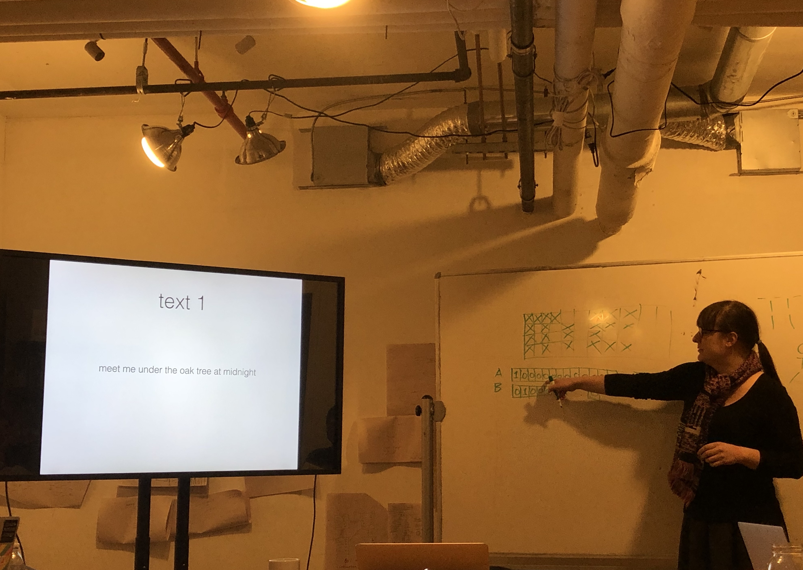
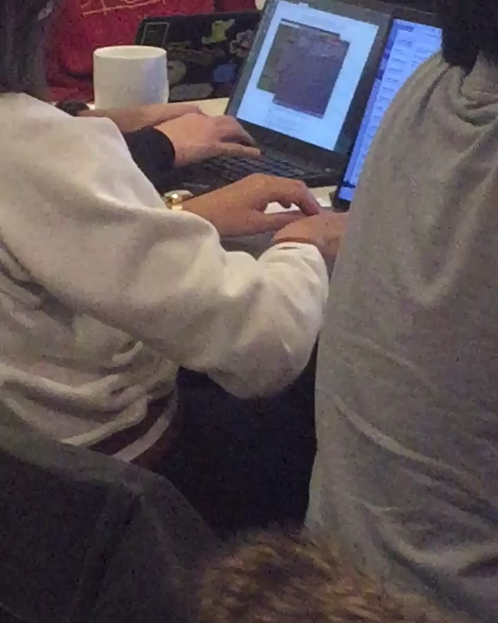
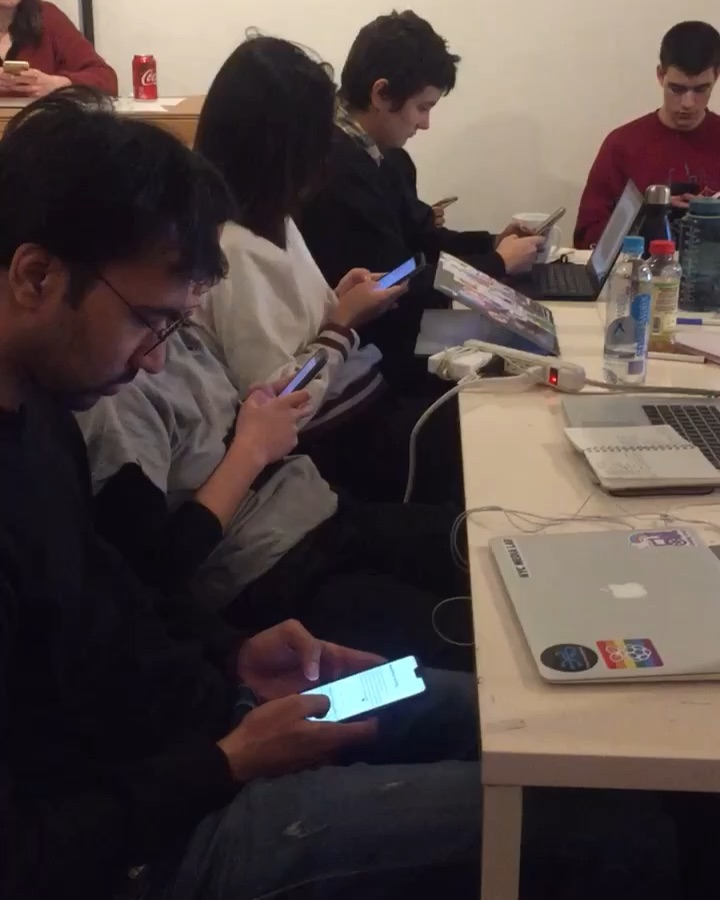

# The Computational Scrawl
Day 3 ~ Code Societies ~ Winter 2019

_This two-part workshop examines the physical gesture and material artifacts of the act of writing, as seen through the lens of computation and digital media. Taking contemporary and historical practices in asemic poetry, experimental typography and automatic writing as inspiration, participants will use the Python programming language to prototype speculative writing technologies that challenge conventional reading practices and notions of sense-making._

Taught by Allison Parrish

Day 3 of Code Societies was led by poet and programmer Allison Parrish. This was the first of two sessions entitled the Computational Scrawl, a workshop where we would engage with the act of writing, its materiality and how it relates to computation and digital media.

For this first session we focused on text, as in letters and words. I realized early on in this session how much writing and typing I actually do on a daily basis and how little I consider the materiality of the tools I am using to do so. It is interesting to consider what our physical bodies look like when interacting with computers and how those interactions dictate the what we are actually writing or making. For me, the session became about answering the question: how do computers change how we think about and process language?

In the first part of the class Allison took us different texts and had us unpack why a particular text was even considered a text at all. We talked about form, structure, intention, style, replicability, logic, interactivity, spatiality, and systems. We looked at text of artists like William Carlos Williams, Apollinaire, and Zach Lieberman. We asked questions of their work and tried to understand their text from a material perspective which led to a bigger question: with the representation of language, what choices are made and for who? What choices are we not considering when looking at a text? The first text we looked at was a simple sentence: "Meet me under the oak tree at midnight". It was centered on the page and in a relatively large font size. It was almost graphic although interestingly enough we did not start to talk about spatiality and form until we were looking at poems and interactive text. Something I would like to ask of every text moving forward is, who is this text intended for? What is the intention of the writer and how do they want or not want the reader respond?

This brought us to automatic writing where the question of intention became something new! With "normal" writing the author will have some sort of intention, at least for what they are going to write, which informs their hand movement which then informs the marks on the page. With automatic writing the author is meant to start from nothing, an unconscious place. This leads to hand movement, not necessarily controlled by the conscious part of the brain, which then leads to marks on the page which may or may not be legible. The question here is what makes a "control". In the case of automatic writing the hand is controlled by sub-conscious or an unconscious force. French avant-garde surrealists as well as a long line of psychologists and spiritualist saw this as a way to get through social representation and to an essential truth, either within the author and from another being.

My favorite part of this class was the automatic writing exercise. We followed these rules:

- Keep your hand moving
- Don’t cross out
- Don’t worry about spelling, punctuation, grammar
- Lose control
- Don’t think. Don’t get logical
- Go for the jugular

First we wrote for 3 minutes with pen and paper. The room was immediately filled with the scratching sound of pencils on paper. This felt the easiest to me. Even if I didn't like what I was writing I felt that it was easy enough to just keep moving my hand.

Next we wrote for 3 minutes on our computers. I couldn't believe how many times my middle finger reached for the delete key. I even wrote about how I couldn't stop pressing the delete key. It was a much more self-correcting experience and I found it difficult to fully let go of the muscle memory in my hand.

Finally we wrote for 3 minutes on our cell phones. The room was now almost silent! A few people said that they found themselves singing in their heads to the rhythm of their typing, others said they went into a sort "work" mode.

This exercised begged the question, what is digital writing? How do things like auto-correct and predictive typing inform the materiality and process of our writing? We could consider digital writing as automatic writing where the "control" is the engineer behind the computer or software we are using.

This class blew my mind and I am very much looking forward to the homework assignment of producing automatic writing using the Gutenberg database and python code!
