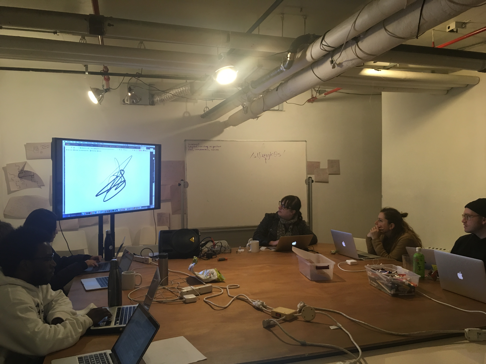
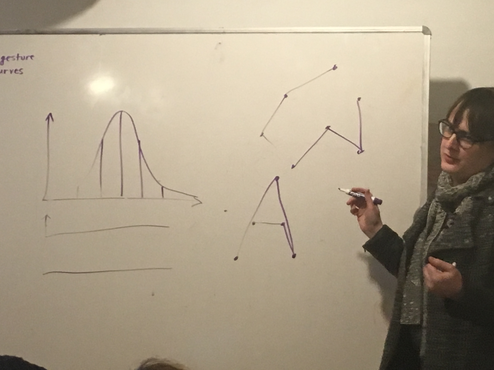

# The Computational Scrawl Session 2

Day 7 ~ Code Societies ~ Winter 2019

_This two-part workshop examines the physical gesture and material artifacts of the act of writing, as seen through the lens of computation and digital media. Taking contemporary and historical practices in asemic poetry, experimental typography and automatic writing as inspiration, participants will use the Python programming language to prototype speculative writing technologies that challenge conventional reading practices and notions of sense-making._

Taught by Allison Parrish

Day 7 of Code Societies was led by poet and programmer Allison Parrish. This was the second of two sessions entitled the Computational Scrawl, a workshop where we engaged with the act of writing, its materiality and how it relates to computation and digital media.

In the first session we focused on the form of a text. For this second session we focused on the act of asemic writing. In other words we began to consider the visual operation of letter and how they come to represent language. We are, of course, exploring this through computation.

The prompt that Allison used to begin this class was "What is writing?". The etymology of the word English word "write" goes back to the words "scratch", "tear", and "carve". Early forms of writing involve carving marks into or the scratching of malleable surfaces like clay or wax. It is interesting to make a distinction between automatic writing and asemic writing. The former is still bound to text as representative of language. While it might not be legible it is still attempting to have itself read. The latter can be compared to abstract painting. It is its own representation of language if it is representative of any language at all. It can evoke the appearance of writing but puts much more value of the visual qualities of writing in order to perhaps create a system that can be "read" by someone irregardless of the languages they speak.

Throughout this session I kept wondering, but what is the purpose of asemic writing? Who is it for? Why make it? We discussed examples of asemic texts like the Voynich manuscript and Xu Bing’s "Book from the Sky". There are people who are still trying to "decode" the Voynich manuscript which to me highlights as possible reason to make asemic writing at all: to avoid analyzation and instead to make the processing of the text an experience which can only be personal. Inspired by the Voynich manuscript, Luigi Serafini made "Codex Seraphinianus", a large book of asemic writing and drawings which he says have no inherent meaning and are meant to insight the reader's imagination.

During the second half of class Allison led us through a Jupyter Notebook in which we used a Python library called flat to draw shapes with code. Using random number functions and circular shapes we were able to create something that started to look like writing.

It seems like the possibilities for what computational asemic writing can be are endless. I wonder how important random number functions are in these exercises. Is a random number function a sort of equivalent to a subconscious/unconscious choice when making marks on a page? There is a constant push and pull between trying to make something look a certain way but also not intentionally creating something representational. Asemic writing seems to sit right in between these two. Whether it is asemic or automatic or completely intentional like the writing in this blog post I am vey much looking forward to exploring the act of writing through computational means!
