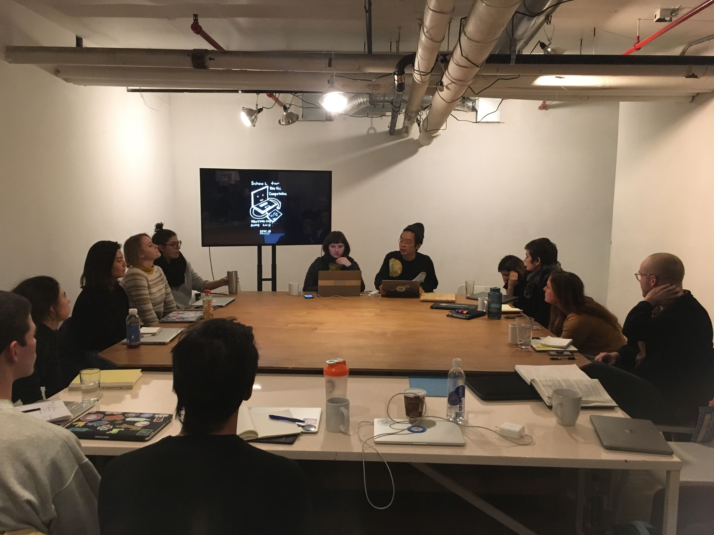
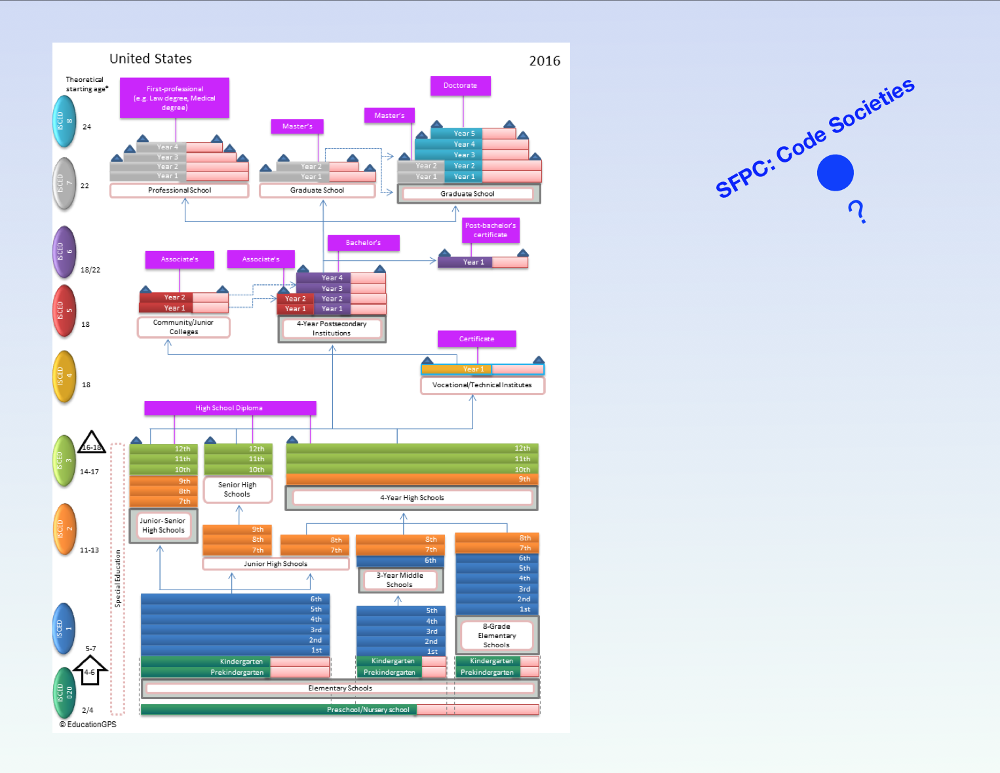
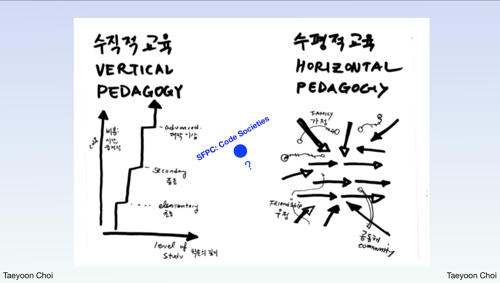
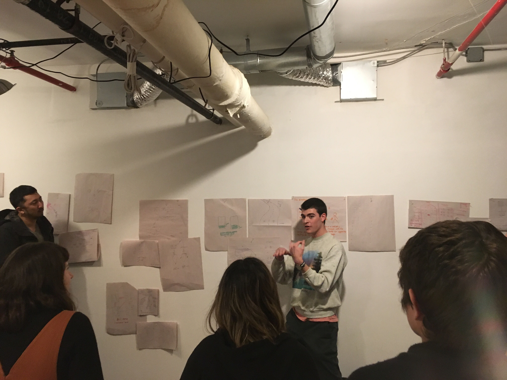

# Introduction to Code Societies
Day 1 ~ Code Societies ~ Winter 2019

[Code Societies Winter 2019](http://sfpc.io/codesocieties-winter-19/) is the second iteration of SFPC’s Code Societies, a three week intensive organized by Melanie Hoff and TA’d by Ying Quan Tan and Nabil Hassein. The first session of the course began by getting to know one another - our names, our origins, our pronouns -  a little bit about where we’re from before embarking towards what we hope to accomplish, both collectively and individually, during our time at SFPC.
 During our introductory session, Melanie challenged us to push the bounds of what we considered code, how code might be used to make sense of ourselves and the spaces that we inhabit, and vice versa. “We can use code to talk about poetics, but we can also use poetics and our bodies and our relationships and much more to talk about code.” Code Societies is both a theme and a prompt - how can we challenge the social and computational codes that already exist and the ways that we understand ourselves in relation to them? Can we challenge ourselves to invent new ones?

Students were asked to come to class prepared to share a technology that has
impacted us personally, and answers ranged from OkCupid to pencil and paper to emojis. Our answers revealed the breadth of what we considered technology; technology can be digital, it can be a software or hardware product, but it can also be analog, it can be tactile, it can be a mundane human interaction. Technology mediates every person’s experience of the everyday, not only in the sense that physical devices or softwares act as intermediaries in our modes of communication, but also in the ways that cultures are also technologies. Melanie cited the example of a handshake and eye contact as a cultural technology developed by many groups of humans with an agenda to create acknowledgement and trust. This tradition dates back to [ancient greece](https://en.wikipedia.org/wiki/Handshake#History) and was initially used to signify peace. A hand being shaken cannot simultaneously hold a weapon. The inclusion of a smile in this interaction could signify an additional agenda.

Following Melanie’s Introduction to Code Societies came Taeyoon Choi’s Introduction to SFPC. SFPC was founded in 2013 by Zach Lieberman, Jen Lowe, Amit Pitaru and Taeyoon Choi. The co-founders were artists, educators, professors who were unhappy with the state of academic institutions, including the expense of attending them. Tuition per semester at major academic institutions in New York like [New York University](https://www.nyu.edu/students/student-information-and-resources/bills-payments-and-refunds/tuition-and-fee-rates/2018-2019/undergraduate-visiting/college-of-arts-and-science-2018-2019/spring-2019.html) or [The New School](https://www.newschool.edu/registrar/tuition-and-fees-2017-2018/) can cost students anywhere from $23,000 to $25,000. A goal of SFPC was to lower the cost of access, but also to make more transparent about how money was being transacted. At SFPC financial decisions are made openly, there are no institutional voids of expense for it to disappear into, no investments in the fossil fuel industry or top 200 publicly-traded coal, oil, and natural gas companies to uncover.

Taeyoon went on to give a short history of the physical space at 155 Bank St - which can be read about in more detail in Code Societies Summer 2018’s [introductory blog post](https://medium.com/sfpc/code-societies-an-introduction-57de026c7c3b) - and the pedagogical foundation that SFPC was built upon. At SFPC, there is no hierarchical power structure - what is being taught and why it is being taught is always up for discussion. Drawing from the Black Mountain College Prospectus, “the student, rather than the curriculum, is the proper center.”

Earlier in Melanie’s presentation they included a diagram of what they called the “Education Industrial Complex,” the American model with which many of us might have intimate experience with. This model is rigid and immalleable, and students must contort themselves and their needs in order to operate within its jurisdiction. Each cohort at SFPC incorporates vertical and horizontal pedagogy SFPC - students are invited to challenge teachers and each other to push the bounds of what a classroom environment can and should be. In having the ability to see the boundaries and limitations of the traditional classroom environment, we can begin to imagine ways that it might be ruptured and torn down. In taking something apart, maybe for the sake of understanding it or disproving it or we generate space to build anew. A pedagogical approach that is radical in its humanity, it accommodation, its openness.

Our last exercise of the day was to represent a piece of code/technology that has shaped society either graphically or linguistically and to explain how. Then, in pairs, we were tasked with combining our idea with a partner in order to make a new code, technology, interface, device, or ritual, and then to represent that as well. Some ideas that came out of this combinatorial exercise were the shufflebus, a bus with a route that could change at any moment - ideal for those who like to travel without knowing where they’re going - and the networked bathroom, a local network that you share with other bathroom patrons allowing people in different stalls to communicate and share content or information.

Code Societies is a microcosm of 18 students, 14 teachers, and 2 Teaching Assistants all here with the intention of learning with and from one another. Together we are a Code Society and we have only just begun. 

